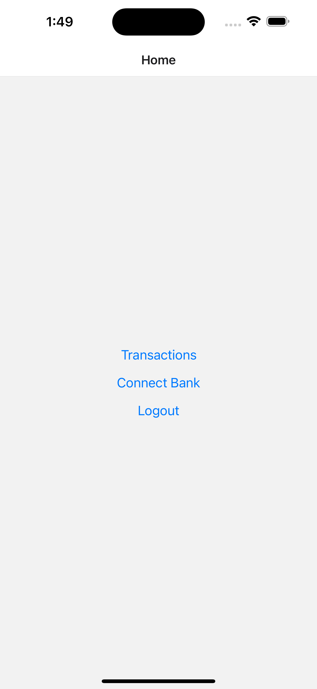
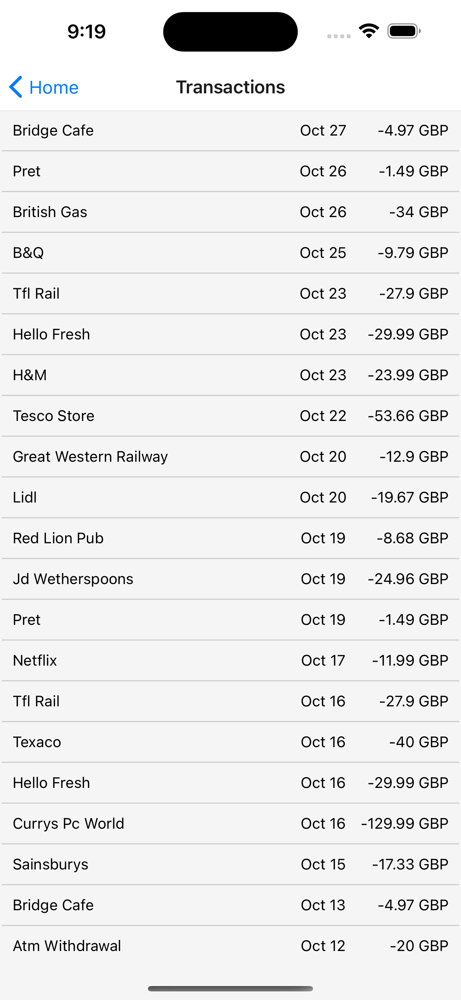
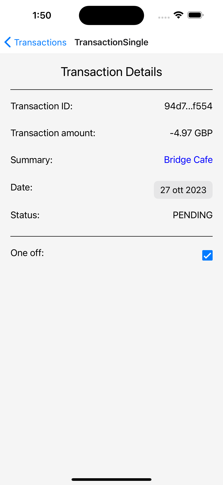
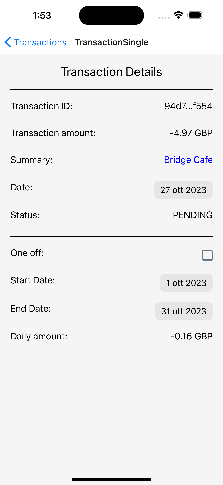

# How I manage my finances

Simple React Native app. Calls [my API](https://github.com/marcopist/ecobud-server) to get my transactions from across all my banks. Lets me tag transactions as one off or related to a period. Shows me daily amount for the transaction.

Later on I will build some budgeting and reporitng features.

Some screenshots:

